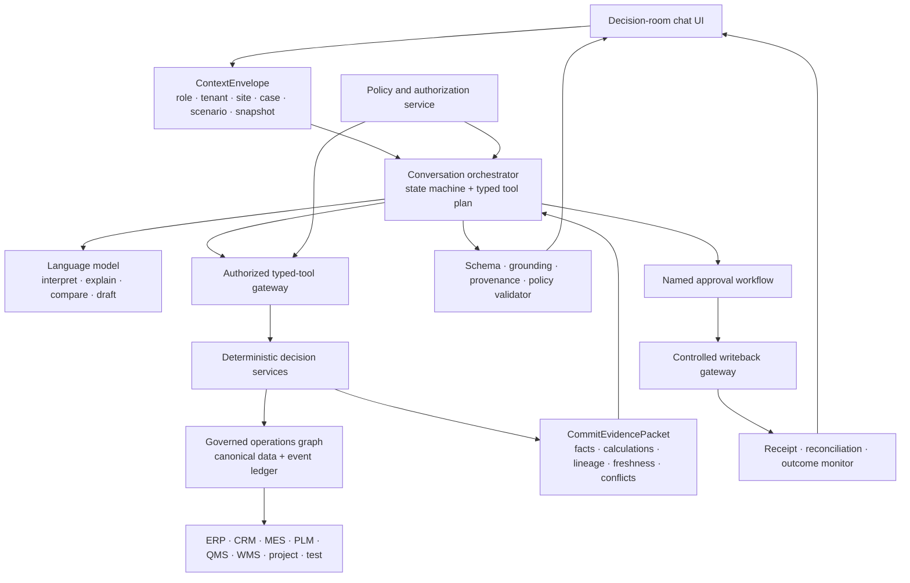

<aside>
💬

**Standalone AI chatbot specification · 26 September 2026**

This page defines only the FORGE conversational experience and its AI control plane. Operational calculations, approvals, writebacks, and business records remain governed services outside the language model.

</aside>

**Document type:** Product and AI architecture specification  

**Status:** Proposed hackathon build specification  

**Audience:** Product, UX, application engineering, data/optimization engineering, security, and demo teams  

**Related PRD:** FORGE — Single-Site PRD v0.2

---

## 1. Executive decision

Build the FORGE chatbot as a **role-scoped decision room**, not a general-purpose assistant, autonomous factory agent, or replacement system of record.

The chatbot helps an authorized user answer:

> **What commitment is at risk, why is it at risk, which recovery options are feasible, who must approve one, what action was taken, and did it work?**
> 

The first implementation should use **one auditable conversation orchestrator with typed tools**. Do not begin with a multi-agent swarm. Deterministic services calculate operational truth; the language model interprets intent, selects authorized tools, explains evidence, compares solver-produced alternatives, and drafts governed communications.

---

## 2. Experience principles

1. **Decision context before prompting:** begin from a commitment, exception, approval, or outcome—not an empty “Ask anything” screen.
2. **Deterministic truth, AI explanation:** official quantities, dates, eligibility, capacity, feasibility, cost, policy, and receipts come from governed services.
3. **Evidence before recommendation:** every material conclusion exposes source, timestamp, lineage, freshness, assumptions, and conflicts.
4. **Visible semantic types:** distinguish source fact, derived calculation, AI explanation, recommendation, approval, attempted action, receipt, and outcome.
5. **Human authority:** named people approve promises, schedule changes, purchases, substitutions, deviations, engineering effectivity, and writebacks.
6. **No hidden state changes:** a conversational response never changes operational systems by itself.
7. **Closed-loop accountability:** preserve baseline, alternatives, rationale, approval, action, receipt, and measured outcome.
8. **Role-scoped disclosure:** both retrieved evidence and generated explanations respect tenant, site, customer, program, product, role, and sensitivity policy.

---

## 3. Chat workspace

Use one desktop decision workspace with four persistent regions.

### 3.1 Context bar

Always display:

- authorized role and tenant;
- selected plant;
- commitment, project, product, or decision case;
- planning horizon;
- baseline or active scenario;
- as-of time and snapshot ID;
- data freshness and conflict state.

The context bar is server-created. The model may reference it but cannot expand its authorization scope.

### 3.2 Decision queue

The left region contains persistent case threads grouped by:

- at risk;
- awaiting investigation;
- awaiting decision;
- awaiting approval;
- actioned;
- monitoring;
- closed or superseded.

A thread is keyed to a stable decision or commitment ID, not only a conversational transcript.

### 3.3 Conversation timeline

The center region mixes concise natural-language responses with native structured blocks:

- risk summary;
- causal chain;
- evidence packet;
- binding constraint;
- scenario comparison;
- infeasibility reason;
- approval request;
- action status;
- receipt;
- observed outcome.

### 3.4 Evidence drawer

The right region provides progressive disclosure for:

- source records and deep links;
- event and ingestion times;
- identity crosswalk and version;
- transformations and calculations;
- freshness and confidence;
- unresolved conflicts or quarantines;
- forward and reverse traceability;
- prior and superseded evidence.

### 3.5 Composer

The composer accepts natural language and exposes only contextually valid actions, such as:

- **Explain risk**
- **Show evidence**
- **Show blast radius**
- **Run scenario**
- **Compare alternatives**
- **Draft approval brief**
- **Request approval**
- **Simulate action**
- **Monitor outcome**

High-impact actions are rendered as explicit buttons or confirmation cards, never inferred from conversational tone.

---

## 4. Conversation lifecycle

A decision thread progresses through:

**Orient → Investigate → Compare → Approve → Act → Observe**

Users may navigate nonlinearly, but FORGE cannot skip required evidence, hard constraints, authorization, approval, or receipt stages.

1. **Orient:** summarize the current commitment, risk, urgency, owner, and evidence health.
2. **Investigate:** trace the causal chain and identify the binding material, capacity, engineering, quality, test, project, or logistics constraint.
3. **Compare:** create an immutable `DecisionRun` and compare solver-produced alternatives against explicit hard and soft constraints.
4. **Approve:** present the selected option, rejected options, rationale, required approvers, policy result, and expiry.
5. **Act:** dry-run and then execute only the approved, authorized action through the controlled gateway.
6. **Observe:** reconcile the receipt and compare expected versus realized operational outcomes.

Changing evidence invalidates or expires affected recommendations. The timeline must show that invalidation rather than silently regenerating history.

---

## 5. Response contract

Every substantive answer follows the same visible structure:

1. **Answer** — current conclusion in one or two sentences.
2. **Why** — binding constraint and causal chain.
3. **Evidence** — source-linked facts, deterministic calculations, freshness, assumptions, and conflicts.
4. **Options** — feasible alternatives plus rejected or infeasible alternatives with the violated hard gate.
5. **Next governed action** — authorized step, owner, approval requirement, and expiry.

If the evidence does not support an answer, state:

- what cannot be established;
- which evidence is missing, stale, conflicting, quarantined, or unauthorized;
- what safe next step can resolve the gap.

During execution, show concise operational progress such as “Checking eligible inventory” or “Comparing leak-test capacity.” Never reveal hidden model reasoning.

---

## 6. AI control-plane architecture

The model has no direct database credentials and no direct writeback access. Tool execution is server-side, authorized, schema-validated, traceable, and bounded to the context envelope.

---

## 7. Request lifecycle

1. Receive the user message and server-created `ContextEnvelope`.
2. Classify intent into a small allowed taxonomy: lookup, explanation, trace, scenario, comparison, draft, approval, action, or outcome.
3. Build a typed tool plan.
4. Run authorization and policy checks before every tool.
5. Execute deterministic tools.
6. Assemble a `CommitEvidencePacket`.
7. Generate an explanation or draft grounded only in the packet and permitted unstructured evidence.
8. Validate the response schema, citations, numerical provenance, policy, stale-state rules, and available actions.
9. Render structured blocks and allowed next steps.
10. Persist the turn, tool calls, snapshot, decision state, prompt/model version, code/config version, and trace ID.

---

## 8. Core contracts

- `ContextEnvelope` — user, role, tenant, site, customer/program/product scope, case, horizon, baseline/scenario, snapshot, as-of time, and allowed operations.
- `CommitEvidencePacket` — source facts, derived facts, lineage, calculations, units, freshness, assumptions, conflicts, missing evidence, and authorization-filtered references.
- `DecisionRun` — immutable baseline, objectives, hard/soft constraints, alternatives, feasibility, trade-offs, model/config version, and expiry.
- `ApprovalRequest` — selected option, rejected alternatives, rationale, required approvers, policy result, timestamps, and status.
- `ActionReceipt` — idempotency key, dry run, attempted action, accepted or rejected writeback, retry, and reconciliation.
- `ObservedOutcome` — expected versus realized commitment, schedule, material, cost, quality/test, and service result.

Chat history is not business memory. Canonical facts and decisions remain in these governed records and are referenced from the conversation by stable ID and version.

---

## 9. Retrieval and memory

### 9.1 Structured truth

Use authorized SQL, graph queries, canonical APIs, and deterministic services for:

- commitments and demand status;
- inventory and eligibility;
- BOM, routing, effectivity, and pegging;
- work orders, WIP, resource capacity, and test gates;
- scenario feasibility and objective values;
- approval policy, actions, receipts, and outcomes.

### 9.2 Unstructured retrieval

Retrieval-augmented generation is secondary and limited to procedures, specifications, contracts, engineering notes, work instructions, and similar documents. Retrieved text:

- is treated as untrusted evidence;
- carries source and version;
- is screened for prompt injection;
- cannot authorize an action;
- cannot override structured source authority or hard gates.

### 9.3 Memory tiers

- **Turn memory:** transient conversation details within the current request.
- **Case memory:** governed decision objects and evidence references for the active thread.
- **User preferences:** low-risk presentation preferences, never operational facts or authority.
- **No implicit cross-case memory:** facts from one tenant, plant, customer, program, or case cannot leak into another.

---

## 10. MVP typed tools

The first build should expose a narrow, testable registry:

- `get_decision_context`
- `get_commitment_snapshot`
- `explain_risk_chain`
- `trace_blast_radius`
- `get_evidence_packet`
- `run_recovery_scenario`
- `compare_alternatives`
- `draft_approval_brief`
- `request_named_approval`
- `simulate_approved_action`
- `get_action_receipt`
- `get_observed_outcome`

Every tool has a versioned input/output schema, authorization policy, timeout, idempotency behavior where relevant, audit event, and deterministic test fixture.

---

## 11. AI responsibility boundary

### AI may

- interpret a role-scoped request;
- select from allowed typed tools;
- summarize evidence and causal chains;
- explain why a constraint binds;
- compare deterministic alternatives;
- draft an approval brief or customer communication;
- identify missing, stale, conflicting, or unmapped evidence.

### AI must not

- calculate official inventory, ATP/CTP, cost, capacity, or schedule feasibility;
- accept identity resolution or source authority;
- waive engineering, quality, qualification, or policy gates;
- approve a decision;
- directly write to operational systems;
- represent a draft as an approved customer commitment;
- present accepted writeback as proof of operational success;
- infer access beyond the server-provided context.

---

## 12. Failure and edge states

The UI requires explicit states for:

- insufficient evidence;
- stale snapshot;
- conflicting sources;
- unauthorized evidence;
- quarantined or unmapped records;
- tool timeout or unavailable service;
- no feasible alternative;
- recommendation expired after evidence change;
- approval rejected, expired, or superseded;
- dry-run failure;
- writeback rejected or partially accepted;
- reconciliation failure;
- outcome still unobserved.

“No feasible alternative” is a valid operating result, not a chatbot error.

---

## 13. Security, audit, and observability

- Enforce tenant and row/field/customer/program/product/role/sensitivity policy server-side.
- Redact secrets and restricted values before prompt construction and logs.
- Treat retrieved documents and tool output as potentially hostile input.
- Validate all tool arguments and generated structured output.
- Require explicit confirmation and named approval for material actions.
- Log prompt version, model version, tools, arguments, results, evidence IDs, snapshot, latency, policy decisions, and trace ID.
- Keep approval separate from execution.
- Require dry run, idempotency, receipt, and reconciliation for writeback.
- Test cross-tenant isolation and prompt-injection resistance.
- Do not train a shared model on customer data by default.

---

## 14. MVP acceptance criteria

The chatbot is ready for the hackathon only if:

- every turn is bound to an authorized `ContextEnvelope`;
- 100% of material numeric claims originate from deterministic services and carry provenance;
- the same snapshot and model/config version reproduce the same operational result;
- source fact, calculation, explanation, recommendation, approval, action, receipt, and outcome are visibly distinct;
- held, expired, failed-test, obsolete, or unqualified supply is never described as eligible;
- infeasible options expose the violated hard gate;
- recommendations expire when governing evidence changes;
- no material action is enabled without required named approval;
- every attempted action produces a receipt or explicit failure;
- an accepted writeback is not labeled a successful outcome until reconciliation and observation support it;
- cross-tenant and unauthorized-field tests return no data;
- the system handles missing evidence and tool failure without inventing an answer.

---

## 15. Hackathon build sequence

1. Build the context bar and decision-thread shell.
2. Implement `ContextEnvelope`, `CommitEvidencePacket`, and stable block schemas.
3. Connect five read-only tools: context, snapshot, risk chain, blast radius, and evidence.
4. Add deterministic scenario execution and alternative comparison.
5. Add approval brief and named-approval workflow.
6. Add simulated action, receipt, and outcome monitoring.
7. Add grounding, schema, stale-state, authorization, and provenance tests.
8. Demonstrate one complete thread from risk through observed outcome.

---

## 16. Explicit non-goals

- A generic company-wide chat assistant.
- Autonomous planning or factory control.
- A multi-agent swarm for the first release.
- Model-generated official calculations.
- Direct LLM access to operational databases.
- Silent background writeback.
- Cross-tenant conversational memory.
- Full-document RAG as a substitute for canonical operational data.
- Treating fluent explanations as evidence of correctness.